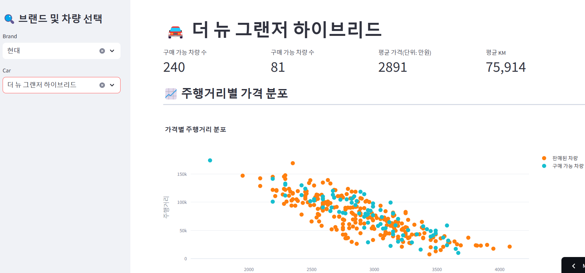

# UsedCar Trend
중고차 매매 데이터 추출 파이프라인 구축 프로젝트

## 프로젝트 소개
Kcar 사이트에서 중고차 매매 데이터를 크롤링하여 데이터 파이프라인 구축 및 시각화하였습니다.

## 프로젝트 구성

  
메인화면

  <figure class="half">  </figure> 

  
브랜드 및 차량 선택 화면

  <figure class="half"> </figure> 

## 시작 가이드
### 요구사항
- Python 3.12
- MySQL
- Streamlit

## ERD 다이어그램

## 아키텍처

### *Data Source*
- [Kcar](https://www.kcar.com/bc/search)

### *Extract*
- Selenium으로 동적 크롤링 및 BS4로 파싱 진행
- 각 페이지 별로 자동차 정보들을 추출

### *Transfrom*
- 추출한 자동차 데이터들을 DB에 적재시키기 위한 형태로 전처리 및 Dictionary로 변환
- 변환한 Dictionary 데이터들을 전체 List에 저장
- 전체 List를 DataFrame으로 변환 및 중복 여부 확인
### *Load*
- DataFrame으로 변환한 데이터들을 MySQL에 삽입
- MySQL에는 총 1개의 임시 테이블(crawling)과 3개의 테이블(main, price_info, sales_list) 존재

## :exclamation: 알게된 점들
### *1. 대용량 데이터 저장*
- SQLAlchemy로 DB INSERT 과정
  

    
execute 사용

      - 처음에는 DB에 for문으로 12826개의 데이터를 하나씩 INSERT하면서 commit을 진행
      - 
  

  

    
to_sql 사용

      - 크롤링한 데이터를 DataFrame으로 변환 후, to_sql를 사용하여 bulk방식으로 INSERT 진행
      -
  

    
  

    
만약 20만개의 데이터를 INSERT한다면?

  

- PyMySQL과 SQLAlchemy의 차이
  

  

