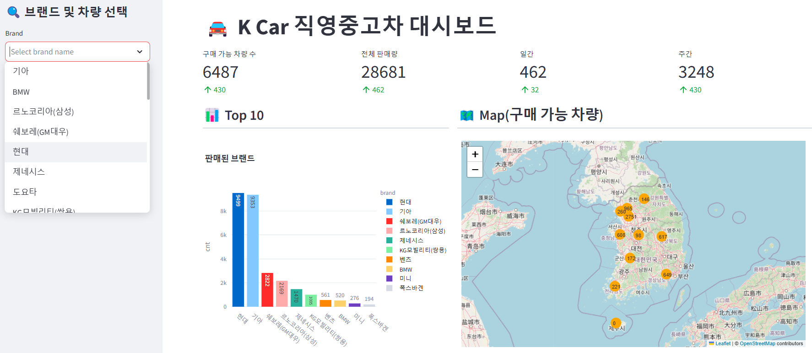

# UsedCar Trend 
중고차 매매 데이터 추출 파이프라인 구축 프로젝트

## 프로젝트 소개
Kcar 사이트에서 중고차 매매 데이터를 크롤링하여 데이터 파이프라인 구축 및 시각화하였습니다.

## 프로젝트 구성
홈페이지 - https://usedcar-trend.streamlit.app/

  
메인화면

  <figure class="half">  </figure> 

  
브랜드 및 차량 선택 화면

  <figure class="half"> </figure> 

## 시작 가이드
### 요구사항
- Python 3.12
- MySQL
- Streamlit

## ERD 다이어그램

## 아키텍처

### *Data Source*
- [Kcar](https://www.kcar.com/bc/search)

### *Extract*
- Selenium으로 동적 크롤링 및 BS4로 파싱 진행
- 각 페이지 별로 자동차 정보들을 추출

### *Transfrom*
- 추출한 자동차 데이터들을 DB에 적재시키기 위한 형태로 전처리 및 Dictionary로 변환
- 변환한 Dictionary 데이터들을 전체 List에 저장
- 전체 List를 DataFrame으로 변환 및 중복 여부 확인
### *Load*
- DataFrame으로 변환한 데이터들을 MySQL에 삽입
- MySQL에는 총 1개의 임시 테이블(crawling)과 3개의 테이블(main, price_info, sales_list) 존재

## :exclamation: 알게된 점들
### *1. Bulk Insert*
- execute 사용
  > for문으로 매번 commit을 진행하는 방식은 총 5.22초가 걸렸습니다.  
  > 

- 대용량 데이터를 저장하는 경우라면?
  > execute을 사용하여 매번 commit하는 방식이 대용량 데이터를 저장할 때도 효율적인지에 대한 의문이 생겨 테스트를 진행하였습니다.
  > 테스트를 위한 데이터가 부족하여 크롤링한 데이터를 약 20만 개로 복제하였습니다.
  
  > execute을 사용했더니 약 5분 34초가 걸렸습니다.  
  > 

  > to_sql을 사용하고 chunksize를 20000으로 설정하니 8.99초가 걸렸습니다.  
  > 

- 성능 차이 발생 이유
  - execute 같은 경우 for문을 돌 때마다 매번 commit을 호출하고 to_sql은 모든 데이터를 한 번에 넣고 commit 또한 한 번만 호출합니다.
  - 또한, commit을 많이 호출하게 되면 디스크 i/o가 발생하여 성능을 저하시킬 가능성이 높습니다.
  - 따라서, 대량의 데이터를 insert하는 경우 batch 단위로 insert하는 **to_sql**을 사용하는 것이 효율적입니다.

### *2. DB 정규화*
- 크롤링한 데이터에서 지불 방식이 할부, 렌트 등으로 지불하는 경우로 인해 데이터 중복 문제가 발생하였습니다.
- main 테이블의 id 컬럼 제약 조건을 PK로 설정하였기 때문에 price_info 테이블 생성 후 저장하였습니다.

